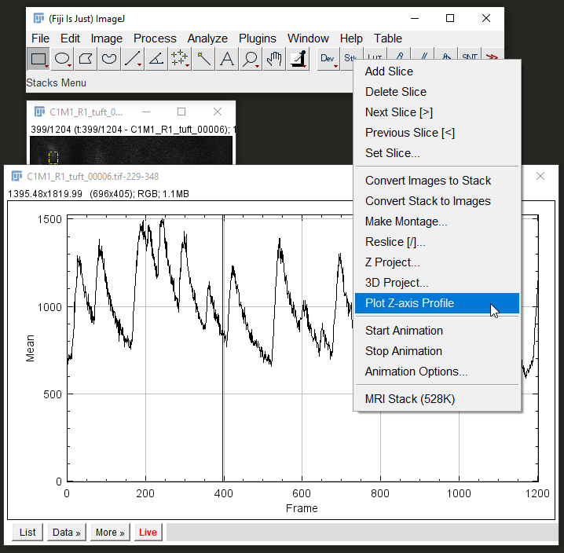

Hello ACAN 2023, here's some pieces for the small data demo! The following is instructions for non-coders. If you can use Python then there's dff-visualisation.ipynb that has a small code demo.

# Instructions
1. Obtain the necessary files and programs
   1. Install [Fiji](https://fiji.sc/) if you don't already have it.
   2. Download and unpack this repository
      1. `Green "Code" Button > Download ZIP`
2. Extract traces (follow steps in the rest of this doc)
   1. Use ImageJ to extract traces
   2. Use Excel to work with extracted traces
   3. If you're familar with programming, you might opt to look at `dff-visualisation.ipynb` instead
   4. Ask a simple question: which of two cells are more active?

# Extracting usable data
## Load in a file
`Plugins > Bio-Formats > Bio-Formats Importer`
- Make sure `Memory management > Use virtual stack` is unticked
  - A virtual stack makes the data not load into RAM, saving RAM space but slowing down trace extraction
- You might also want to load in multiple files and then concatenate them together (if they're videos of the same stuctures)
- `Image > Adjust > Brightness/Contast` to make the image more visible to the eye
## Draw an ROI
- Select the Rectangle tool (top left in the toolbar)
- Draws a rectangle that you can drag around the image, reshape, or just click and drag outside of it to draw a new rectangle
  - If you want finer control over shape you could use the Polygon tool
- `Analyze > Tools > ROI Manager` if you want to add multiple ROIs and save them
  - Press <key>t</key> to add ROIs into the manager
  - You can find more docs about using it [here](https://imagej.nih.gov/ij/docs/menus/analyze.html#manager)
## View a trace

- `Stk > Plot Z-axis Profile`
- Z-axis in our case is time
- Press `Live` in the profile window to have it update whenever you move your shape
- The line is the average of all of the pixels contained within the shape, for each frame in the video

## Finding $\frac{\Delta{}F}{F_0}$
Normally, we'd use code to do this stuff. We're going to do something a little bit cursed: we're going to use Excel to do some data processing. We'll do this because I'm here to give you the *feel* of what the analysis is, not to teach you how to code (although you totally should learn!). I think using Excel might be a curious but also intuitive example of what data normalisation involves. This is what `dff_visualisation.xlsx` is for.

The file has a `you` sheet which is where you should work, and `g example` which features an example of what an end result might look like.

1. Copy data from z-axis profile window `Data > Copy All Data`
2. Paste into Excel at A1 (should paste in Frame and Mean columns)

The `dff analysis` sheet in the spreadsheet shows a janky, simplified version of an event detection algorithm.

There's things I don't know how to do in Excel like smoothing and a rolling baseline, although I'm sure it's possible.

On Saturday you'll be analysing and presenting some data, so have a think about what you might do for this. Perhaps you want to look at some biological properties of what you've recorded, or maybe something more analysis specific?